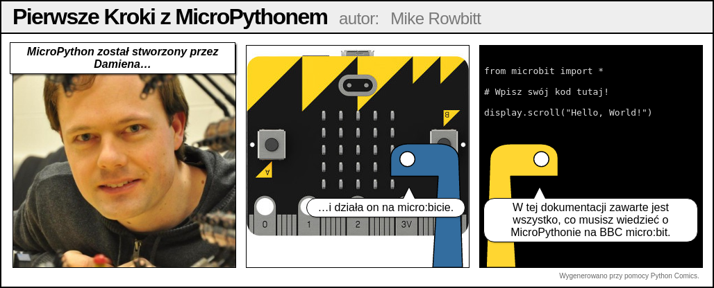

.. BBC Microbit Micropython documentation master file, created by
   sphinx-quickstart on Tue Oct 20 10:41:30 2015.
   You can adapt this file completely to your liking, but it should at least
   contain the root `toctree` directive.

Dokumentacja do MicroPython dla BBC micro:bit
=============================================

Witaj!

BBC micro:bit to niewielkie urządzenie obliczeniowe dla dzieci. Jednym z
języków, które ono rozumie, jest język programowania Python. Odmiana Pythona,
która działa na BBC micro:bit nazywa się MicroPython.

Ta dokumentacja zawiera lekcje dla nauczycieli i opis interfejsu aplikacji dla
programistów (spójrz na listę po lewej stronie). Mamy nadzieję, że programowanie
z użyciem MicroPythona dla BBC micro:bit sprawi ci wiele przyjemności.

Jeśli nigdy wcześniej nie programowałeś, albo nie jesteś pewien od czego zacząć, zacznij od paradników.

Aby stać się częścią społeczności, zapisz się do grupy microbit@python.org
(https://mail.python.org/mailman/listinfo/microbit).

.. note::

   Ten projekt jest w stanie ciągłego rozwoju. Pomóż innym dodając
   do dokumentacji porady, sztuczki, uwagi i odpowiedzi na często
   zadawane pytania. Dziękujemy!
    
Projekty związane z MicroPythonem na BBC microb:bit to między innymi:

* `Mu <https://github.com/ntoll/mu>`_ - prosty edytor kodu dla dzieci, nauczycieli i początkujących programistów. Najpewniej najłatwiejszy sposób na programowanie w MicroPythonie na BBC micro:bit.
* `uFlash <https://uflash.readthedocs.io/en/latest/>`_ - narzędzie linii poleceń do wgrywania programów w pythonie do BBC micro:bit.

.. toctree::
    :maxdepth: 2
    :caption: Poradniki

    tutorials/introduction
    tutorials/hello
    tutorials/images
    tutorials/buttons
    tutorials/io
    tutorials/music
    tutorials/random
    tutorials/movement
    tutorials/gestures
    tutorials/direction
    tutorials/storage
    tutorials/speech
    tutorials/network
    tutorials/radio
    tutorials/next

.. toctree::
   :maxdepth: 2
   :caption: Interfejs aplikacji

   microbit_micropython_api.rst
   microbit.rst
   accelerometer.rst
   ble.rst
   button.rst
   compass.rst
   display.rst
   filesystem.rst
   i2c.rst
   image.rst
   music.rst
   neopixel.rst
   os.rst
   pin.rst
   radio.rst
   random.rst
   speech.rst
   spi.rst
   uart.rst

.. toctree::
   :maxdepth: 2
   :caption: Instrukcja dla programistów

   devguide/installation
   devguide/flashfirmware
   devguide/repl
   devguide/devfaq
   devguide/contributing

.. toctree::
   :maxdepth: 2
   :caption: Indeksy i tabele

* :ref:`genindex`
* :ref:`modindex`
* :ref:`search`
